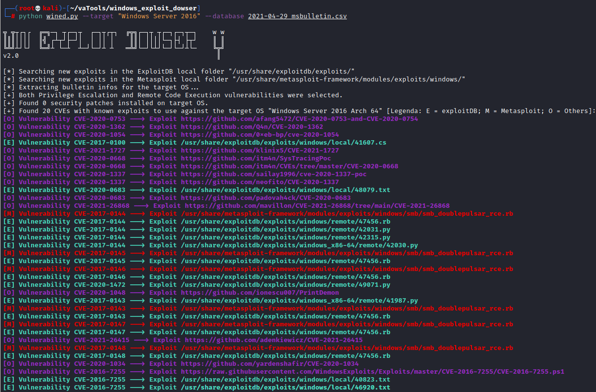

Windows Exploit Dowser
======================


# Description 
Windows Exploit Dowser is a python script which could be useful in penetration testing or 
security gaming (CTF) activities to identify the available public exploits (for Privilege 
Escalation and Remote Code Execution vulnerabilities) afflicting the target Windows OS 
specified by user (all Windows version are supported).

This is achieved by means of the comparison between the patch level of the target Windows OS 
(retrieved via "systeminfo" or "wmic qfe list full" commands run on the target host) and
the infos extracted from the official MS Windows Bulletins.

The list of MS Bulletins is obtained from two sources:
*   the new MS Bulletin summary file (starting from date 17-03-2017), which is provided 
    from the official repository hosted at <del>"https://portal.msrc.microsoft.com/en-us/security-guidance"</del> 
    "https://msrc.microsoft.com/update-guide" and downloadable (as csv file) by using the "--update" command-line option;
*   the old MS Bulletin (ending date 17-03-2017), which was provided from the official 
    repository hosted at "http://download.microsoft.com". It is downloadable 
    from this repo as csv file "old_2017_03_14_msbulletin.csv" (if not already present on the working folder).


The list of public exploits is automatically retrieved from the ExploiDB and Metasploit local
repo that must be present on the user host (their filepath could be also explicitly specified 
by user). Other exploits could be added manually by editing the dictionary named 
"CUSTOM_EXPLOITS_DICT" hardcoded on this script. 

Furthermore to decrease the percentage of false negative it is also possible to use the option
"--build" in order to create/update a csv file containing the list of some particular ExploitDB 
scripts which do not have a CVE hardcoded on their source code.
The CVEs of this kind of exploits could only be recovered by querying the corresponding pages
of the official ExploitDB website.

The list of the potential working exploits for the missing hotfixes is printed in output.

Depending on the selected command-line options, can also be printed out:
*   all the CVEs related to the missing hotfixes in the Windows target OS ("--verbose" option)
*   the list of exploits related to software components which could be installed on the Windows target OS ("--greedy" option)
*   the list of DoS exploits affecting the target OS ("--crash" option)


# Limitations
Since the results are based only upon the missing hotfixes, they can be not precise and could 
incur on some false positives. In particular the effective running software components on the 
target Windows OS are not known (so the "--greedy" option could drastically increase this 
percentage).


# Notes
This script is heavily inspired by the excellent "Windows Exploit Suggester" tool by Sam 
Bertram (Gotham Digital Science), which sadly seems no longer supported.


# Dependencies
The installation of the Python package "BeautifulSoup4" is required.
The script is compatible with Python 2.7 and Python 3.


# Usage
This is an example of Windows Exploit Dowser output:




Below are reported some usage examples of the tool. 
Use the "--help" option for a more exhaustive list.

Update the MS Bulletin database:
```
$ python wined.py --update
```

Search exploits using the "systeminfo" input, specifying the local MS Bulletin database (option 
required) and excluding DoS exploit:
```
$ python wined.py --database 2019-05-12_msbulletin.csv -s win10_sysinfo.txt

```

Search exploits using the "systeminfo" input, specifying the local MS Bulletin database and 
considering also DoS exploit:
```
$ python3 wined.py -d 2019-05-12_msbulletin.csv --systeminfo win10_sysinfo.txt --crash
```

Search exploits using the "wmic qfe list full" input, specifying a custom metasploit repo 
folder and requesting a verbose output (all unpatched CVEs are printed):
```
$ python3 wined.py -d 2019-05-12_msbulletin.csv -w winserver2008_wmicinfo.txt -m /home/tester/metasploit-framework/embedded/framework/modules/exploits/windows/ -v
```

Search only Remote Code Execution exploits using the "wmic qfe list full" input, specifying a 
custom exploitdb repo folder:
```
$ python wined.py --database-d 2019-05-12_msbulletin.csv --wmicinfo winserver2008_wmicinfo.txt --exploitdb_dir /home/tester/exploitdb/exploits --remote
```

Search exploits specifying the target OS directly via user input, specifying a greedy search (
also exploits for Microsoft software components, more false positives):
```
$ python wined.py --target "Windows Server 2012 Release 2 Arch 64" --database 2019-05-08_msbulletin.csv  --greedy
```

Build or update the csv file containing the CVEs extracted from official ExploitDB website (
reduce false negatives), specifying a custom exploitdb repo folder:
```
$ python3 wined.py -b /home/tester/exploitdb/exploits
```


# Author
Windows Exploit Dowser was developed by Maurizio Siddu


# GNU License
Copyright (c) 2019 Windows Exploit Dowser

This program is free software: you can redistribute it and/or modify
it under the terms of the GNU General Public License as published by
the Free Software Foundation, either version 3 of the License, or
(at your option) any later version.

This program is distributed in the hope that it will be useful,
but WITHOUT ANY WARRANTY; without even the implied warranty of
MERCHANTABILITY or FITNESS FOR A PARTICULAR PURPOSE. See the
GNU General Public License for more details.

You should have received a copy of the GNU General Public License
along with this program.  If not, see <http://www.gnu.org/licenses/>

